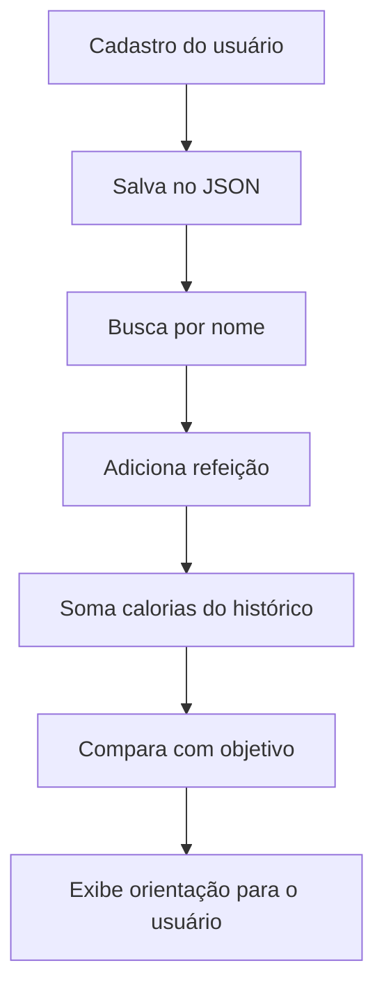

# Sobre o Projeto
* O Projeto é um sistema de controle de calorias, feito inteiramente em Python, com foco em acompanhar as refeições do usuário, calcular o total calórico diário e orientar o objetivo da pessoa, seja emagrecimento, ganho de massa ou manutenção.
* Funcionalidades: o sistema cadastra usuários com dados pessoais, adiciona refeições com suas calorias, calcula o total diário, consulta informações do usuário e compara o consumo com a meta definida pelo objetivo.
* Toda a persistência dos dados é feita em JSON, permitindo que o sistema guarde as informações do usuário e das refeições mesmo após o fechamento do programa.

# Sobre a lógica do sistema
* O coração do sistema está na persistência dos dados em um único arquivo JSON, onde cada usuário é salvo com suas informações e refeições.
* A partir disso, o programa consegue localizar o usuário, somar calorias, consultar dados e decidir se o consumo está dentro da meta esperada.
* Esse fluxo é importante porque garante que o usuário tenha um histórico real e que suas informações possam ser acessadas sempre que quiser.

## Estrutura principal dos dados
* O arquivo principal do projeto é `dados_user_calorias.json`.
* Nele cada usuário é salvo em um formato parecido com este:

```json
[
  {
    "user": {
      "name": "bruna",
      "age": 20,
      "weight": 69.0,
      "height": 1.69,
      "objective": 1,
      "meals": [
        {
          "refeicao": "Café da manhã",
          "calories": 340
        }
      ]
    }
  }
]
```

* Esse objeto guarda tudo que o sistema precisa: nome, idade, peso, altura, objetivo e também as refeições com suas calorias.

# Como o sistema funciona

## 1. Cadastro do usuário
* Quando o usuário entra no sistema, ele pode se cadastrar com nome, idade, peso, altura e objetivo.
* A função principal desse passo é salvar corretamente as informações em um registro único.

```python
def cadastro():
    nome = input("Qual o seu nome?: ").lower().strip()
    idade = int(input("Quantos anos você tem: "))
    peso = float(input("Quanto você pesa?: "))
    altura = float(input("Qual a sua altura: "))
    objetivo = int(input("Qual seu objetivo? Digite sua opção: 1. Emagrecer | 2. Ganhar peso | 3. Manter|: "))
    adicionar_usuario(nome, idade, peso, altura, objetivo)
    salvar_dados()
```

* A partir daí, o sistema passa a identificar esse usuário em qualquer consulta posterior.

## 2. Busca do usuário no JSON
* O sistema procura o usuário pelo nome antes de qualquer ação, como adicionar uma refeição ou consultar os dados.
* Isso garante que as operações sempre afetem o cadastro correto.

```python
def procurar_user(nome):
    for user in dados:
        if nome.lower() == user["user"]["name"].lower():
            return user
    else:
        print("[bold red]Usuário não encontrado![bold red]")
```

* Essa busca é o ponto central do sistema porque conecta a entrada do usuário com o registro salvo no JSON.

## 3. Adição de refeições
* Quando o usuário adiciona uma refeição, o sistema localiza o cadastro correto e insere a refeição com o nome da refeição e a quantidade de calorias.

```python
def adicionar_refeicao(nome, nome_refeicao, calorias):
    procurar = procurar_user(nome)
    procurar["user"]["meals"].append({"refeicao": nome_refeicao, "calories": calorias})
    salvar_dados()
```

* Essa lógica é extremamente importante porque cada refeição vira um item dentro do histórico do usuário, que depois será usado para somar calorias e avaliar o objetivo.

## 4. Cálculo do total diário
* Depois que o usuário registrou suas refeições, o sistema percorre todos os itens de `meals` e soma as calorias.

```python
def total_calorias(nome):
    soma = 0
    procurar = procurar_user(nome)
    if procurar:
        for refeicao in procurar['user']['meals']:
            soma += refeicao["calories"]

        print(f"[bold green]Total de calorias: {soma}kcals")

    salvar_dados()
    return soma
```

* Esse cálculo funciona como o “coração” do sistema, porque ele transforma os dados em informação útil para o usuário.

## 5. Decisão inteligente baseada no objetivo
* Além de somar calorias, o programa avalia se o usuário está em déficit, superávit ou manutenção, dependendo do objetivo escolhido.

```python
def decisao_inteligente(nome):
    procurar = procurar_user(nome)
    peso_atual = procurar['user']['weight']
    fator = procurar['user']['objective']
    total = total_calorias(nome)
    deficit = peso_atual * 20
    superavit = peso_atual * 40
    manutencao = peso_atual * 30
```

* Essa parte do código é a responsável por transformar os números em orientação real para o usuário.
* Se o objetivo for `1`, ele analisa o déficit calórico;
* se for `2`, analisa o superávit;
* se for `3`, analisa a faixa de manutenção.

# Persistência dos dados em JSON
* O sistema conta com persistência feita em JSON, que garante que as informações do usuário e das refeições fiquem salvas no arquivo `dados_user_calorias.json`.
* Isso permite que, mesmo fechando e abrindo o programa, o estado anterior seja mantido.

```python
def salvar_dados():
    with open("dados_user_calorias.json", "w") as arquivo:
        json.dump(dados, arquivo, indent=4, ensure_ascii=False)
```

* Esse método é o elo entre a execução do programa e o armazenamento dos dados em disco.
* Sem ele, o sistema perderia todas as refeições e cadastros após encerrar a aplicação.

# Fluxo de dados do sistema



* Esse fluxo mostra a lógica principal do projeto: o usuário entra no sistema, os dados são guardados, as refeições são adicionadas, calculadas e comparadas com a meta escolhida.

# Como rodar
* Garanta que sua máquina tenha o Python a partir da versão 3.13 ou superior.

* Instale a biblioteca Rich, caso ainda não tenha:

```bash
pip install rich
```

  
* Baixe o arquivo do repositório e execute no terminal:

```bash
python contadorCalorias.py
```

* Depois disso, siga as opções do menu e comece a registrar suas refeições.

# Conclusão
* O projeto é uma solução simples, mas eficiente, para controle de alimentação e acompanhamento de objetivos.
* Sua maior força está na organização dos dados em JSON e na lógica de cálculo e orientação por objetivo.
* Em resumo, o sistema transforma o histórico de refeições em uma ferramenta útil para entender o consumo calórico diário e ajustar a alimentação de forma consciente.
